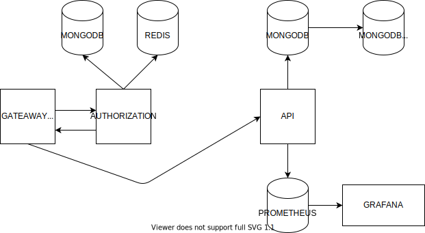
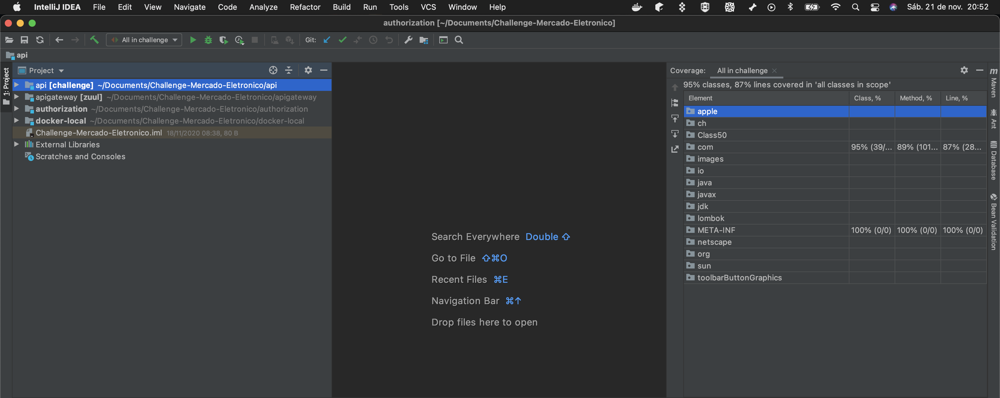

# Arquitetura

## Todo o projeto foi desenvolvido utilizando Java 11 e Spring Boot

Foi desenvolvido um api gateway utilizando o zuul do Netflix OSS que é responsável por tratar as requisições aos demais serviços.

A autenticação é feita através do microsserviço authorization que é responsável pela geração de um token JWT na rota de login e depois o gateway recebe este token em todas as requisições atraves de um header.

Com este token um filtro desenvolvido no gateway faz uma requisição ao serviço authorization para verificar se este token é válido. 

Obs: Para evitar uma sobrecarga no banco de dados do authorization, os tokens são gravados no redis.

A microsserviço desenvolvido para tratar os pedidos utiliza um banco de dados mongodb que possui uma replica de leitura. Além disso ele envia informações para o Prometheus e foram feitos dois Dashboards no Grafana para a monitoria da aplicação.

## Observações
* Os testes estão cobrindo 95% das classes, 89% dos métodos e 87% das linhas.

* Não consegui fazer teste do endpoint de pedido para validar o envio de um pedido já existente, pois o Embbeded Mongo não permite a crição de uma unique constraint. Os demais cenários de pedido e status foram feitos.

## Como rodar a aplicação
Foi utilizado o docker para subir toda a infraestrutura necessária para o projeto, por isso o docker é a única ferramenta necessária para subir a aplicação.

Para iniciar o projeto basta executar o arquivo start-services.sh que está na pasta docker-local. Ele executará o comando docker-compose up que fará o build da aplicação, copiará os arquivos necessários e executará alguns comandos no mongodb.

O projeto utiliza várias variáveis de ambiente que estão definidas em arquivos que são lidos no docker-compose.

## O que vai subir
* apigateway.me - serviço responsável por tratar as requisições;
* authorization.me - microsserviço responsável pela autenticação;
* api.me - microsserviço que trata dos pedidos;
* mongo.me.authorization - banco de dados do serviço de autorização
* redis.me.authorization - redis do serviço de autorização
* mongo.me1 - banco de dados principal do serviço de api
* mongo.me2 - replica de leitura do banco de dados principal de api
* prometheus.api.me - prometheus do projeto
* grafana.me - grafana do projeto

## As únicas portas que serão expostas pelo docker são:
* 7000 - apigateway
* 3000 - grafana
* 9090 - prometheus

## Como testar a aplicação
Foi criada uma collection do postman com todas as requisições relacionadas ao projeto.

## Passo a passo
1 - Chamar o endpoint http://localhost:7000/login. Ele aceita requisições do tipo POST.

Header - Content-Type - application/json

Payload 
{
    "login":"mercadoeletronico",
    "password": "123"
}

Este usuário foi cadastrado durante a inicialização do projeto.

Este endpoint retornará o token que deverá ser passado para as próximas requisições.

2 - Para testar o endpoint de pedido a rota é http://localhost:7000/api/pedido. Ele aceita os métodos POST, PUT, DELETE e GET.  

Header - Content-Type - application/json. 

Header - token - {token gerado no passo 1}. 

Payload de exemplo
{
  "pedido":"123456",
  "itens": [
  {
    "descricao": "Item A",
    "precoUnitario": 10,
    "qtd": 1
  },
  {
    "descricao": "Item B",
    "precoUnitario": 5,
    "qtd": 2
  }
  ]
}

2 - Para testar o endpoint de status a rota é http://localhost:7000/api/status. Ele aceita apenas o método POST.  

Header - Content-Type - application/json. 

Header - token - {token gerado no passo 1}. 

Payload de exemplo. 
{
  "status":"REPROVADO",
  "itensAprovados": 0,
  "valorAprovado": 0,
  "pedido":"123456"
}

3 - Para visualizar o grafana o endereço é http://localhost:3000/

* Usuário: admin
* Senha: admin

Foram disponibilizados dois dashboards:

*  Mercado Eletronico API - JVM - Neste dashboard estão sendo mostradas métricas de JVM da aplicação.
*  Mercado Eletronico API - PEDIDOS - Neste dashboard estão sendo mostrados os dados relacionados aos pedidos realizados.

## Ainda pendente de fazer
*  Criar testes nos microsserviços apigateway e authorization
*  Invalidar tokens antigos quando um novo login é realizado
*  Enviar os logs das aplicações para uma ferramenta de tratamento de logs
